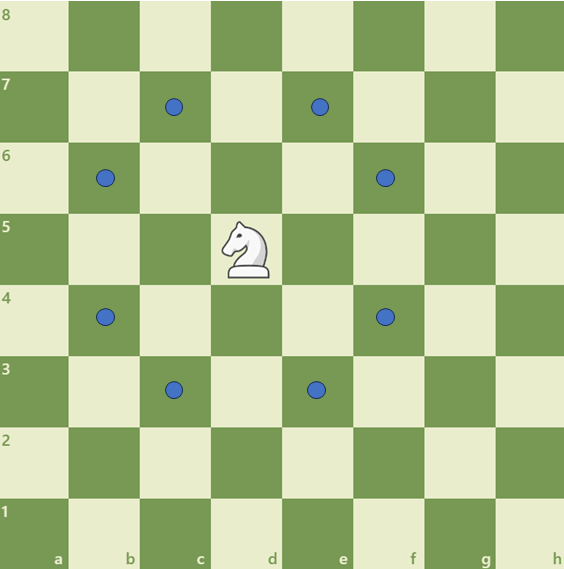
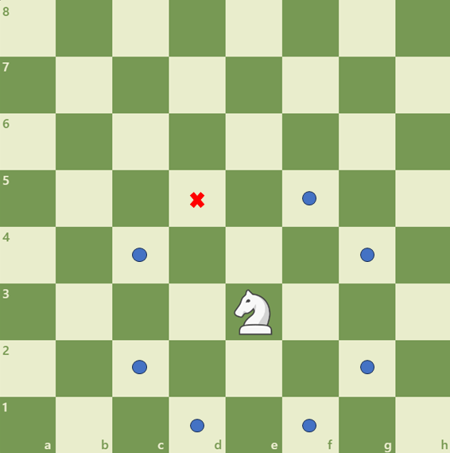
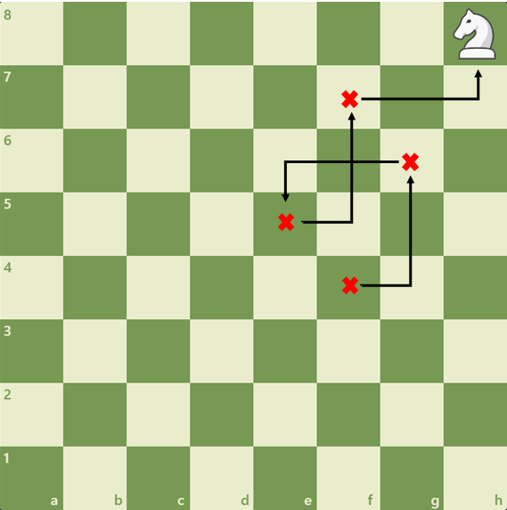
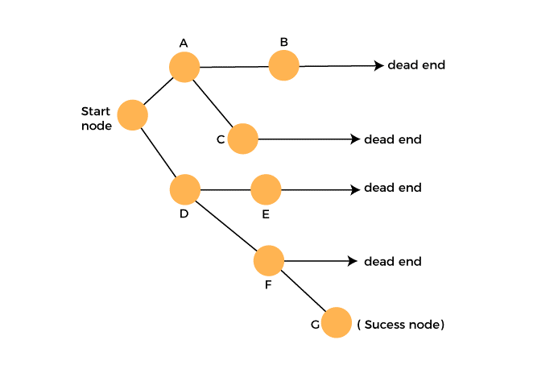

# Knight’s Tour
The Knight's Tour, a actually a mathematical problem ([Hamiltonian Path](https://www.geeksforgeeks.org/hamiltonian-cycle/)) with origins dating back to the ninth century, involves a knight commencing its journey from any square on the board and then maneuvering through the remaining squares, all without revisiting any previously occupied square. 

## Table of Contents
- [About](#about)
  - [Backtracking](#backtracking)
  - [Recursion](#recursion)
  - [Warnsdorff's Rule](#warnsdorffs-rule)
- [Getting Started](#getting-started)
  - [Prerequisites](#prerequisites)
  - [Installation](#installation)
- [Usage](#usage)
- [Features](#features)
- [Acknowledgements](#acknowledgements)
- [References](#references)

## About

This project presents an engaging exploration of the Knight's Tour problem across a range of chessboard sizes, including 5x5, 6x6, 7x7, 8x8 and 9x9. It serves as an implementation and visualization of the Knight's Tour problem, featuring a solving algorithm constructed through recursion and the application of Warnsdorff's heuristic rule.


### Backtracking

First, let's begin by visualizing and considering how to tackle the Knight's Tour problem. Let's assume we start at position D5. Now, let's examine the potential moves available from this starting point:



Because the knight moves in an 'L' shape, involving 2 moves in one direction and 1 in another, we have a total of 8 potential moves at our disposal. Let's select one:



Now, you can see that we have only 7 possible moves since we have already been to one of them (D5). It's important to keep in mind that making the wrong choices of movements can lead to getting stuck in the tour. Let's take a look at the example below:



In the example above, the knight moved as follows: F4, G6, E5, F7, and H8. From position H8, the knight has two options: G6 and F7, but unfortunately, these have already been visited. In this case, we need to backtrack one (or more, depending on the situation) step and try different paths to avoid getting stuck. To solve this, the software was built using the backtracking technique. So for each dead end, the program goes back one move and tries a different one.



### Recursion

Since we need to check many different possible paths and, therefore, call the solution function several times, the software uses recursion to solve this. Let's take a look at the structure of the solution function:

```python
def solution():
    if all squares are visited:
        print "Knight's Tour"
        return True
    else:
        possible_movements = possible_movements_function()

        if possible_movements == []:
            """If there are no possible movements, we return False. This will remove this move from the solution vector, backtrack one movement, and try other alternative moves."""

        for move in possible_movements:
            """Add the move to the solution vector and recursively check if this move leads to a solution.

            If the move chosen in the above step doesn't lead to a solution, then remove this move from the solution vector and try other alternative moves.

            If none of the alternatives work, then return false. Returning false will remove the previously added item in recursion, and if false is returned by the initial call of recursion, then "no solution exists.""""

``` 

### Warnsdorff's Rule

You can imagine that this would take a while to compute since from each position, we have 8 (or fewer) possible next moves, and each one of these next moves produces more possible moves. As a result, you can notice that this leads to exponential growth in the number of possible paths, and as you explore different paths, the search space expands rapidly. Another cost factor for the computation is the number of possible solutions you can return, which makes the challenge not just finding one specific solution, but rather finding any valid solution. Therefore, we need a feature in our software that makes it faster, and that's Warnsdorff's Rule.

This simple rule was formulated by the German mathematician H.C. Warnsdorff in 1823, and it consists of the following principle:

> **Always move the knight to an adjacent, unvisited square with minimal degree.**

Let's elaborate on this a bit more and try to understand it. The primary objective of this rule is to move the knight to an unvisited square that has the fewest possible moves. However, because Warnsdorff’s rule is heuristic, it is not guaranteed to find a solution.


## Getting Started

### Prerequisites
### Installation


## References

- https://www.chess.com/analysis?tab=analysis
- https://support.sas.com/resources/papers/proceedings15/3060-2015.pdf
